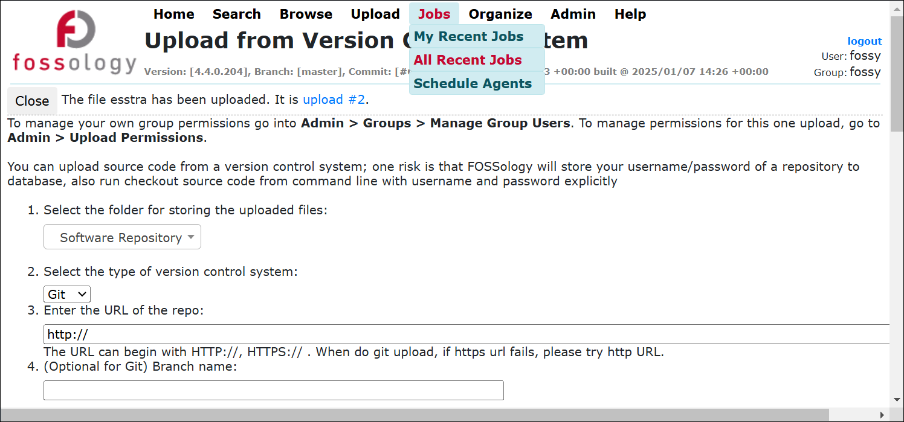
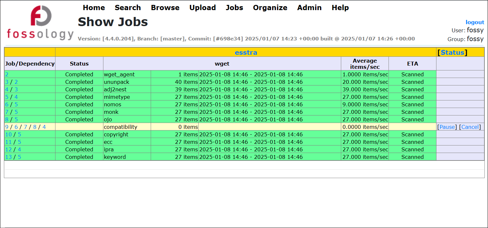
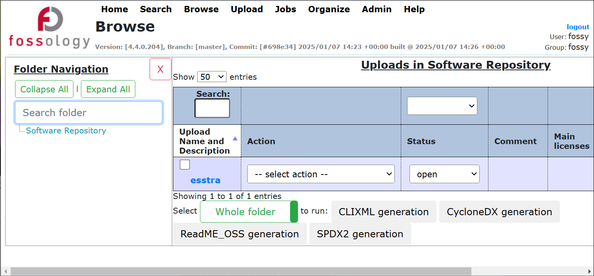
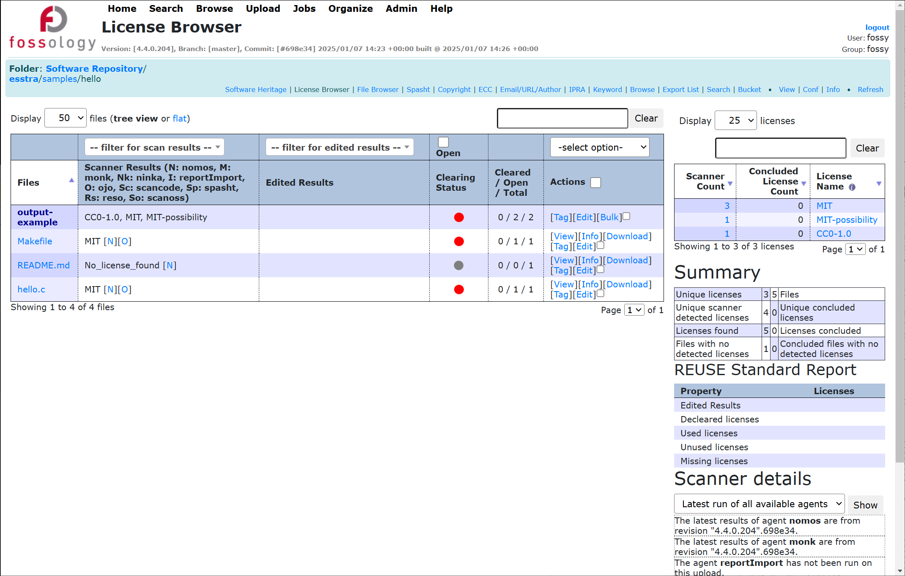
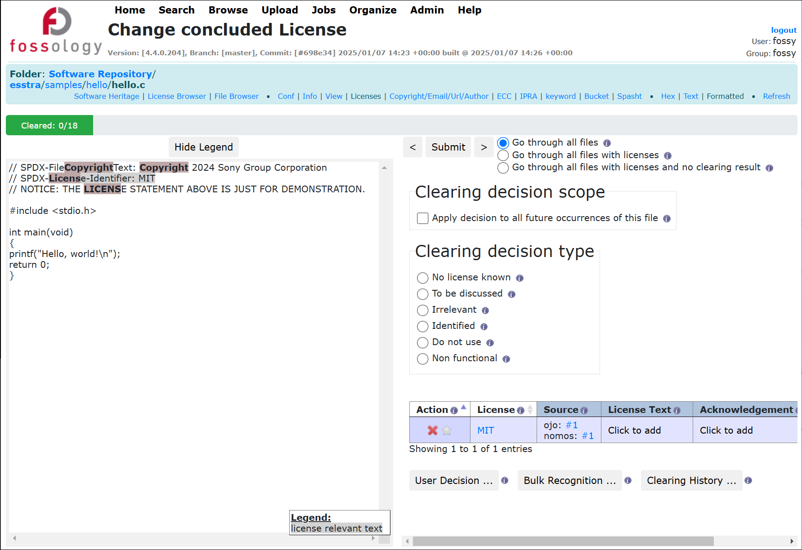
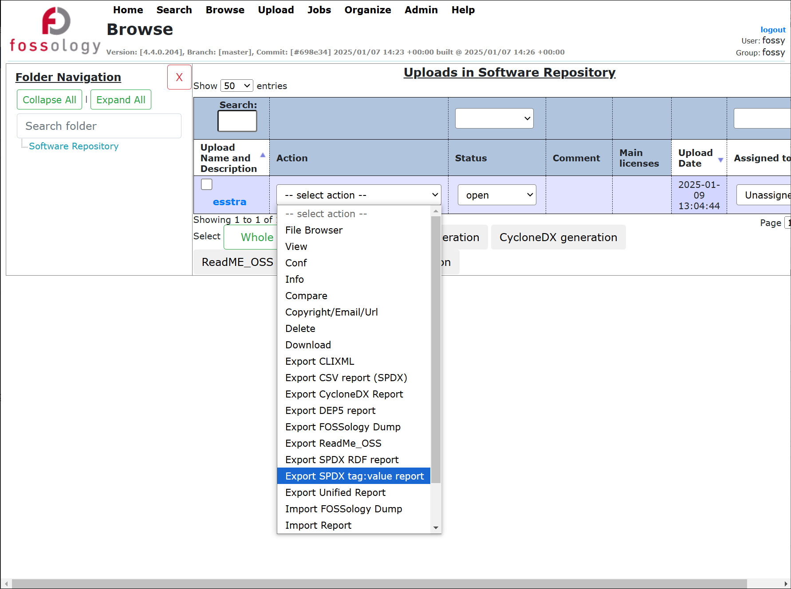

# Sample "hello"

In this sample, we will explain how to use ESSTRA with a simple source code
written in C. This document is structured as a step-by-step guide, allowing you
to easily understand the basic operations of ESSTRA by following each step in
order.

First, we will compile `hello.c`, which is located in this directory, using
ESSTRA Core to generate the binary file `hello`. This binary includes metadata
containing information about all the source files involved in the compilation,
such as absolute paths and checksums. We will verify this using ESSTRA Utility.

Next, we will demonstrate how to use the feature of ESSTRA Utility that adds
license information of source files to the metadata. In this sample, we will
use the open-source software license analysis tool
[FOSSology](https://github.com/fossology/fossology)
to scan the source code for licenses and generate a license information
file. We will then update the metadata using ESSTRA Utility based on this
information and verify that the license information has been correctly added to
the metadata.

The operation procedures for the license analysis tool FOSSology are also
explained in this guide.

## Building and Installing ESSTRA

First, build and install ESSTRA on your system. In the top directory, enter:

```sh
$ make
```

If there are no errors, the build is complete. Then, enter:

```sh
$ sudo make install
```

This will install ESSTRA Core and ESSTRA Utility on your system.

## Source Code to Compile

In this sample, we will compile the source code `hello.c` using
ESSTRA Core. The content of the code is as follows, and it is a very simple
program that just prints `Hello, world!` to the standard output:

```c
#include <stdio.h>

int main(void)
{
    printf("Hello, world!\n");
    return 0;
}
```

Additionally, at the beginning of the source code, we explicitly state the
license so that FOSSology can scan it in a later step:

```c
// SPDX-License-Identifier: MIT
```

This declaration indicates that this file is available under the
[MIT License](https://spdx.org/licenses/MIT.html).

## Compiling with ESSTRA Core

Use the following command line to compile `hello.c` and generate the binary
`hello`. By involving ESSTRA Core during compilation, metadata will be
embedded into `hello`.

```sh
$ gcc -fplugin=/usr/local/share/esstra/esstracore.so hello.c -o hello
```

If you have already [installed the Spec File](../../README.md),
ESSTRA Core will intervene in
the compilation without needing the `-fplugin=` option, yielding the same
result as above:

```sh
$ gcc hello.c -o hello
```

Note that ESSTRA Core does not affect the behavior of the binary. When you
run the generated binary `hello`, you will get the following result:

```sh
$ ./hello
Hello, world!
```

## Verifying Metadata in the Binary

To display metadata embedded in the binary file `hello`, type:

```sh
$ esstra.py show hello
```

You can see a list of directories and files as well as SHA-1 hashes in YAML
format. These files are all involved in the compilation of the file `hello`:

```yaml
#
# BinaryFileName: output_example/hello
# BinaryPath: /home/snagao/esstra/samples/sample-hello/output_example/hello
#
---
SourceFiles:
  /home/snagao/esstra/samples/sample-hello:
  - File: hello.c
    SHA1: 62592ce351eab2dfb75deb8c01101e07d6fe3c67
  /usr/include:
  - File: features-time64.h
    SHA1: 57c3c8093c3af70e5851f6d498600e2f6e24fdeb
  - File: features.h
    SHA1: d8725bb98129d6d70ddcbf010021c2841db783f7
  - File: stdc-predef.h
    SHA1: 2fef05d80514ca0be77efec90bda051cf87d771f
  - File: stdio.h
    SHA1: c7181b48c4194cd122024971527aab4056baf600
  /usr/include/x86_64-linux-gnu/bits:
  - File: typesizes.h
    SHA1: ee94b5a60d007c23bdda9e5c46c8ba40f4eb402c
  - File: wordsize.h
    SHA1: 281ddd3c93f1e8653e809a45b606574c9b691092
  /usr/include/x86_64-linux-gnu/bits/types:
  - File: FILE.h
    SHA1: 497924e329d53517631713ae52acb73e870d7d65
  - File: __FILE.h
    SHA1: 274242343e85d1c06e7f5ccc5abf15e120f6e957
  - File: __fpos64_t.h
    SHA1: ac38e294b004f6e2bf18f1c55e03dc80f48d6830
  - File: __fpos_t.h
    SHA1: 760ef77769ac1921f4b1f908cbf06863e2506775
  - File: __mbstate_t.h
    SHA1: e3a4f2ee55e635520db0b4610d2b361e9ce41de7
  - File: struct_FILE.h
    SHA1: 1dbf8bac589cb09e09aa4c1d36913e549a57bcf0
  /usr/include/x86_64-linux-gnu/gnu:
  - File: stubs-64.h
    SHA1: f7603fa3908b56e9d1b33c91590db3252e13a799
  - File: stubs.h
    SHA1: be168037b7503a82b1cf694cdbac8c063bb6e476
  /usr/include/x86_64-linux-gnu/sys:
  - File: cdefs.h
    SHA1: a419a6372029d89ba38ada0811d34f51df8d09b7
  /usr/lib/gcc/x86_64-linux-gnu/11/include:
  - File: stdarg.h
    SHA1: fa23f49da8a0a5068b781dff7182f1a1c363dc30
  - File: stddef.h
    SHA1: 0de70008ffa3f198baf55c7b3f3d03b4ca11c21f
```

The output of the `show` command is in YAML format and includes the following
information about all source files involved in the compilation:

* Absolute path of the source file in the compilation environment
* SHA-1 checksum of the source file

The structure of the output YAML data is as follows, with the information for each file grouped by directory:

```yaml
#
# BinaryFileName: <specified_binary_name>
# BinaryPath: <absolute_path_of_the_specified_binary>
#
SourceFiles:
  <directory_name>:
  - File: <filename>
    SHA1: <SHA1_checksum>
  - File: <filename>
    SHA1: <SHA1_checksum>
  <directory name>:
  - File: <filename>
    SHA1: <SHA1_checksum>
  - File: <filename>
    SHA1: <SHA1_checksum>
      :
      :
```

The metadata of the binary `hello` includes not only the source code `hello.c`
specified at compile time and the explicitly `#include`'d `stdio.h` from
`hello.c`, but also additional header files. This is because GCC implicitly
`#include`'s the header file `stdc-predef.h` and all the header files recursively
`#include`'d from `stdio.h`.

## License Analysis Using FOSSology

ESSTRA Utility has a feature that adds license information to the metadata of
each file. Below are the steps to add the license information of hello.c to the
metadata of the binary hello using this feature.

As a preliminary step, you need to create a document in
[SPDX tag-value format](https://spdx.dev/learn/overview/)
that includes the license information of the source files. Here, we will
demonstrate how to use the open-source software license analysis tool
[FOSSology](https://github.com/fossology/fossology)
for this purpose.

### Starting the FOSSology Server

We will use the FOSSology container image provided on
[Docker Hub](https://hub.docker.com/).
Pull the FOSSology container image with the following command:

```sh
$ docker pull fossology/fossology
```

Once successful, start the FOSSology server with the following command:

```sh
$ docker run -p 8081:80 fossology/fossology
```

This will allow you to access the FOSSology server via port 8081 on the
host. Open a web browser and go to:

* `http://<host_ip_addr>:8081/repo`

When accessing FOSSology, you need to append `/repo` to the URL.

Then the FOSSology startup screen will appear in your browser. Enter `fossy` for
both "Username:" and "Password:" to log in.


### Analyzing Source Code with FOSSology

Although we only need the license information for `hello.c` in this sample, for
simplicity, we will scan the entire
[ESSTRA GitHub repository](https://github.com/sony/esstra)
and generate a single license information file that can be used for other samples
as well.

First, click on the "Upload" menu at the top of the screen and select "From
Version Control System".


You will be taken to a screen titled "Upload from Version Control System".
Then enter:

* "https://github.com/sony/esstra".

in the field "3. Enter the URL of the repo:".


Scroll down the page and check at least the following items listed under
"11. Select optional analysis:", then click the "Upload" button at the bottom
of the page:

* Monk License Analysis
* Nomos License Analysis
* Ojo License Analysis


The page will reload, and you should see a message just below the logo at the
top of the screen saying:

* The file esstra has been uploaded. It is upload #x.

Then, click on the "Jobs" menu at the top of the screen and select "All Recent Jobs".



A list of jobs running within the FOSSology system will be displayed. Wait
until all the jobs are "Completed".



Next, click on the "Browse" menu at the top of the screen. A list of source
codes loaded into FOSSology will be displayed. Confirm that an item named
"esstra" appears and click on it.



You will be taken to a page titled "License Browser". On this screen, you can
see the results of the license scan for all files in the
[ESSTRA repository](https://github.com/sony/esstra).


In this sample, we will check if `hello.c` is recognized as MIT licensed as
intended. Click on `samples` \> `hello` \> `hello.c` in sequence.



Finally, you will be taken to a screen displaying the contents of
`hello.c`. Check the "License" section in the table at the bottom right.



Since it shows "MIT", we can confirm that FOSSology has correctly recognized
the license of `hello.c` as "MIT License".

### Downloading FOSSology Scan Results

Click on the "Browse" menu at the top of the screen to navigate to the page
displaying the list of source codes loaded into FOSSology.

Click on "-- select action --" to the right of "esstra" to reveal a dropdown
list, then select "Export SPDX tag:value report". This will download the scan
results for all files in the
[ESSTRA repository](https://github.com/sony/esstra)
as an SPDX tag-value format file named
[`SPDX2TV_esstra.spdx`](../output-examples/SPDX2TV_esstra.spdx).



Below is a portion of the downloaded file `SPDX2TV_esstra.spdx`:

```yaml
SPDXVersion: SPDX-2.3
DataLicense: CC0-1.0

##-------------------------
## Document Information
##-------------------------

DocumentNamespace: http://789bc35d6e0e/repo/SPDX2TV_esstra.spdx
DocumentName: /srv/fossology/repository/report
SPDXID: SPDXRef-DOCUMENT

   :

##--------------------------
## File Information
##--------------------------

   :

##File

FileName: esstra/samples/hello/hello.c
SPDXID: SPDXRef-item146
FileChecksum: SHA1: e7834d0b9cb6cb116c72f0bee7da29e3d280b27e
FileChecksum: SHA256: 8134eae34d2a46ffdaedc04628427282d3d73ae47affd33463111efc89fa5a96
FileChecksum: MD5: b5ca38edd7197004cfb8290d0ca0e87d
LicenseConcluded: NOASSERTION

LicenseInfoInFile: MIT
FileCopyrightText: NOASSERTION

   :

```

This file contains various pieces of information, however, you can see that the
information of the file `hello.c` includes a line `LicenseInfoInFile: MIT`.

## Adding License Information to Metadata

To add license information to the metadata in the binary using ESSTRA Utility
with the `SPDX2TV_esstra.spdx` file downloaded from FOSSology, execute the
following command:

```sh
$ esstra.py update hello -i SPDX2TV_esstra.spdx
* processing 'hello'...
* done.
```

If no errors occur, the process is successful. To display the metadata content
of the binary hello, use:

```sh
$ esstra.py show hello
```

The result will be as follows:

```yaml
#
# BinaryFileName: hello
# BinaryPath: /home/snagao/esstra/samples/hello/hello
#
SourceFiles:
  /home/snagao/esstra/samples/hello:
  - File: hello.c
    SHA1: e7834d0b9cb6cb116c72f0bee7da29e3d280b27e
    LicenseInfo:
    - MIT
  /usr/include:
  - File: features-time64.h

       :

```

From the above results, we can see that the file `hello.c` has been tagged with
`LicenseInfo`, and the value assigned to it is `MIT`.

Please note that the file `SPDX2TV_esstra.spdx` generated previously by
FOSSology only contains license information for the files present in the
[ESSTRA repository](https://github.com/sony/esstra).
Therefore, license information will not be assigned to files
other than `hello.c` in the metadata of `hello`.

To add license information for those files, you can also use FOSSology or
similar tools to identify their licenses and generate an SPDX tag-value format
file. By passing the file to ESSTRA Utility, you can add license information
to the metadata in the binary.

## Summary

In this sample, we first compiled the source file `hello.c` using ESSTRA Core
to generate the binary `hello`, and confirmed that the metadata in `hello`
includes information about all the files involved in the compilation.

Next, we used the ESSTRA Utility to add license information to the metadata in
`hello`.
For generating the license information, we demonstrated how to use the
open-source license analysis tool
[FOSSology](https://github.com/fossology/fossology)
to scan the licenses of all the files in the
[ESSTRA repository](https://github.com/sony/esstra)
and generate an SPDX tag-value format file.
